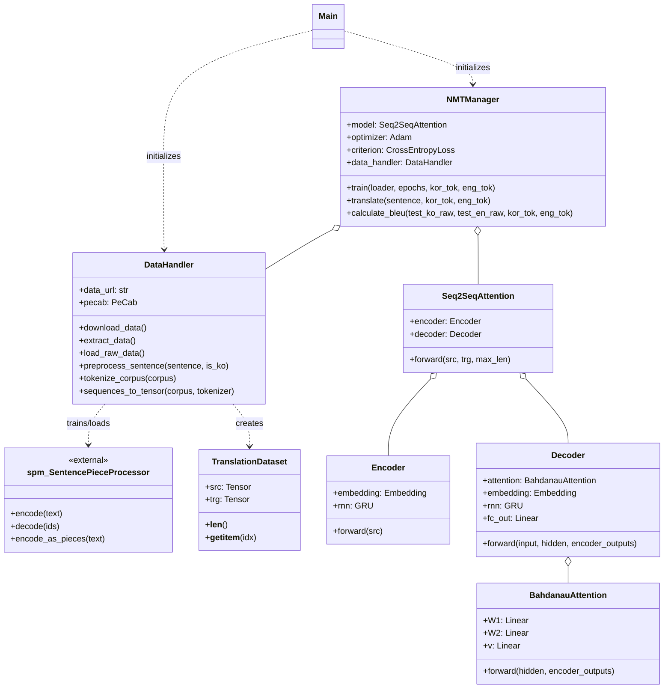
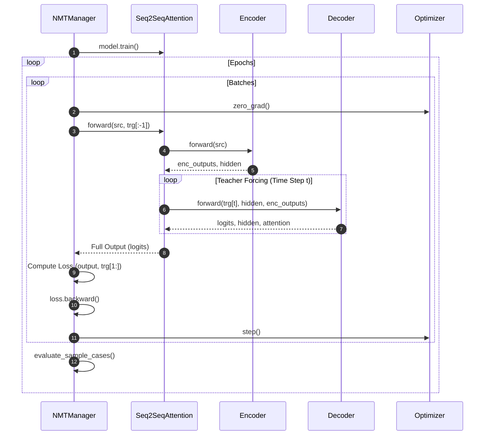
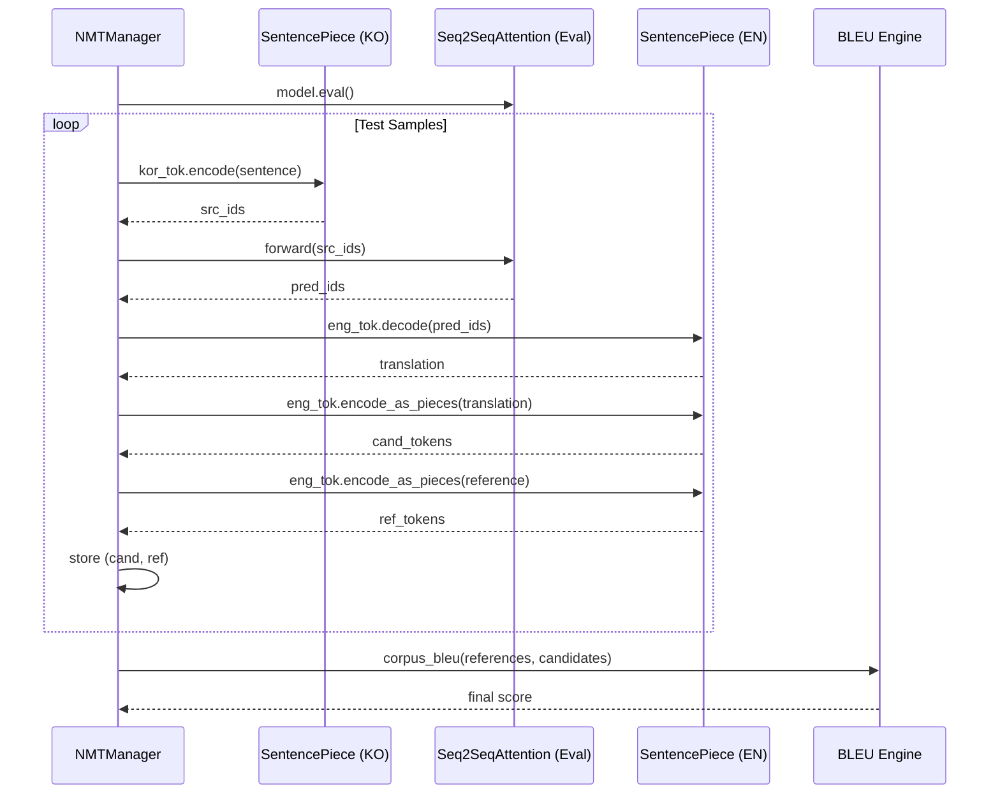

## 프로젝트: 한영 번역기 만들기

목표 : 한영 병렬 코퍼스를 활용하여 한국어를 영어로 번역하는 **Attention 기반 Seq2seq 모델**을 설계하고 학습

### 0. 환경 설정 및 라이브러리 점검

주요 라이브러리의 버전을 확인합니다.

* **Target Libraries:** `pandas`, `torch`, `matplotlib`

### 1. 데이터 확보 (Step 1)

학습에 필요한 한영 병렬 데이터를 다운로드합니다.

* **데이터셋:** `korean-english-park.train.tar.gz`
* **출처:** [jungyeul/korean-parallel-corpora](https://github.com/jungyeul/korean-parallel-corpora)

### 2. 데이터 정제 (Step 2)

데이터의 품질을 높이기 위해 다음 과정을 거칩니다.

1. **중복 제거:** `set` 자료형을 활용하여 중복 데이터를 제거합니다. (병렬 쌍이 어긋나지 않도록 주의)
2. **데이터 저장:** 정제된 데이터는 `cleaned_corpus`에 저장합니다.
3. **전처리 함수 재정의:**
* 한글에 특화된 정규 표현식을 추가하여 `preprocessing()` 함수를 업데이트합니다.
* **영어(Target):** 문장 시작과 끝에 `<start>`, `<end>` 토큰을 추가하고 `split()`으로 토큰화합니다.
* **한국어(Source):** `KoNLPy`의 `Mecab` 클래스를 사용하여 형태소 분석 및 토큰화를 진행합니다.

4. **데이터 선별:** 학습 효율을 위해 토큰 길이가 **40 이하**인 데이터만 선별하여 `kor_corpus`와 `eng_corpus`를 구축합니다.

### 3. 데이터 토큰화 (Step 3)

정제된 코퍼스를 모델이 이해할 수 있는 텐서 형태로 변환합니다.

* `tokenize()` 함수를 사용하여 데이터를 텐서화하고 각각의 Tokenizer를 생성합니다.
* **단어 사전 크기:** 최소 **10,000개 이상**으로 설정하며 실험을 통해 최적값을 찾습니다.
* **참고:** 데이터 규모를 고려하여 별도의 검증 데이터(Validation Set) 분리 없이 전체를 훈련에 사용합니다.

### 4. 모델 설계 (Step 4)

한국어를 영어로 번역하는 **Attention 기반 Seq2seq** 구조를 설계합니다.

* **구조:** Encoder - Decoder (with Attention Mechanism)
* **하이퍼파라미터:** `Embedding Size`와 `Hidden Size`는 실험을 통해 최적화합니다.

### 5. 모델 훈련 및 결과 제출 (Step 5)

모델을 학습시키고 번역 성능을 확인합니다.

* **훈련 방식:** 기존 훈련 코드를 사용하되, `eval_step()` 과정은 생략합니다.
* **성능 확인:** 매 스텝마다 아래 예문에 대한 번역 결과를 생성합니다.
* **시각화:** `Attention Map`을 시각화하여 모델이 단어 간의 관계를 어떻게 파악하는지 확인합니다.

#### 테스트 예문 (Evaluation)

| ID | 한국어 예문 (Input) | 기대 출력 (Example) |
| --- | --- | --- |
| **K1** | 오바마는 대통령이다. | obama is the president . `<end>` |
| **K2** | 시민들은 도시 속에 산다. | people are victims of the city . `<end>` |
| **K3** | 커피는 필요 없다. | the price is not enough . `<end>` |
| **K4** | 일곱 명의 사망자가 발생했다. | seven people have died . `<end>` |

### 🛠 트러블슈팅 (Troubleshooting)

* **Mecab 경로 오류 발생 시:**
1. 런타임/리소스 초기화
2. 세션 재시작 후 다시 실행

---

### 1. 작업 요약 (Work Summary)

본 프로젝트는 기존의 한영 번역기 코드를 유지보수와 확장이 용이하도록 다음과 같이 개선했습니다.

* BASE LINE 확보
    *   **클래스 기반 리팩토링**:
        *   `DataHandler`: 데이터 다운로드, 전처리, 캐싱, 텐서 변환 담당
        *   `NMTManager`: 모델 학습 루프 및 번역(추론) 관리 담당
        *   `Tokenizer` & `Seq2SeqAttention`: 모듈화된 어휘 사전 및 모델 구조
    *   **성능 및 효율성 개선**:
        *   **토큰화 캐싱**: `pickle`을 활용하여 전처리된 데이터를 저장함으로써 재실행 시 속도를 대폭 향상
        *   **하이퍼파라미터 관리**: `config` 딕셔너리를 도입하여 실험 설정값(학습률, 배치 크기 등)을 한곳에서 관리
        *   **실험 로그**: 학습 전 현재 설정값을 출력하도록 하여 실험 간 비교 용이성 확보
    *   **실행 로직 분리 (Decoupling)**:
        *   `run_experiment(config, test_cases)`: 핵심 실험 로직을 인자 기반 함수로 분리하여 재사용성 및 실험 편의성 증대
        *   `main()`: 설정을 정의하고 `run_experiment`를 호출하는 Wrapper 역할로 단순화
    *   **개발 환경 확장**:
        *   `quest_2.ipynb`: `quest.md`의 설명과 리팩토링된 코드를 결합한 Jupyter Notebook 생성 (스크립트와 동일한 `run_experiment` 구조 적용)

    * **성능 평가 (Evaluation)**:
        * 테스트 데이터셋에 대한 `BLEU Score` 및 정량적 평가 로직 도입

* EDA
    * **기본 통계**:
        * 전체 문장 수: 94,123개
        * 중복 제거 후: 78,968개 (약 15,155개 중복 제거)
    * **문장 길이 (글자 수 기준)**:
        * 한국어: 평균 64자, 95% 분위수 112자
        * 영어: 평균 134자, 95% 분위수 241자
    * **시각화 결과**: [eda_results](file:///home/torious/projects/AIFFEL_quest_eng/NLP/NLP01/eda_results) 폴더에 히스토그램 및 산점도 저장 완료

### 2. 향후 개선 사항 (TODO)

실험 비교 및 성능 평가의 객관성을 높이기 위해 다음 내용들을 추가로 구현할 계획입니다.

- [ ] **환경 구성**: `pip install`을 통한 필수 라이브러리(`pecab` 등) 설치 안내 추가
- [ ] **데이터 분석 (EDA)**: 한영 병렬 말뭉치의 문장 길이 분포 및 어휘 빈도 분석
- [ ] **실험 결과 자동 저장**: 각 실행별 `config`와 `Loss` 변화를 JSON 또는 CSV 파일로 로깅
- [ ] **모델 저장 및 불러오기 (Save/Load)**: 학습된 모델 가중치를 저장하고 필요 시 재로드하여 추론에 활용하는 기능 추가
- [ ] **흐름도 (Flow Chart)**: 전체적인 전처리 및 학습/평가 프로세스를 시각화하는 Flow Chart 추가
- [ ] **시각화 (Visualization)**: Attention Weight를 활용한 번역 프로세스 **Heatmap** 시각화
- [ ] **전문 실험 관리 도구 연동**: `Weights & Biases (wandb)` 또는 `TensorBoard`를 연결하여 시각화 및 비교 분석 개선
- [ ] **성능 튜닝**: `config` 딕셔너리를 활용하여 다양한 하이퍼파라미터 조합(Grid Search 등) 실험 진행
- [ ] **모델 고도화**: Attention 메커니즘 개선(Multi-head Attention 등) 및 Transformer 모델 적용 고려

### 3. 클래스 다이어그램 (Class Diagram)

### 4. 시퀀스 다이어그램 (Sequence Diagram)

#### 4.1. 학습 프로세스 (Training Process)

#### 4.2. 평가 프로세스 (Evaluation & BLEU)

